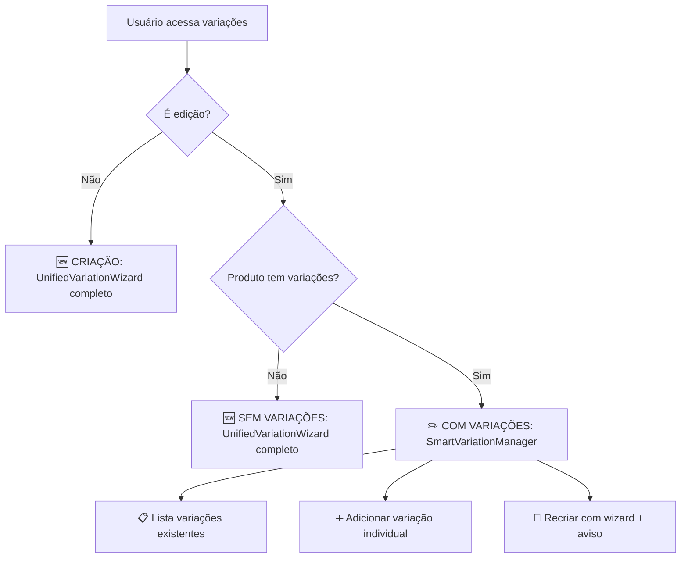

# ✅ **AJUSTE EDIÇÃO DE PRODUTOS - CONCLUÍDO**

## 🎯 **PROBLEMA RESOLVIDO**

**Situação Anterior**: Ao editar produtos que já possuíam variações, o sistema sempre mostrava o wizard de criação, ignorando as variações existentes.

**Solução Implementada**: Sistema inteligente que diferencia entre **criação** e **edição**, oferecendo interfaces adequadas para cada situação.

---

## 🧠 **LÓGICA IMPLEMENTADA**

### **📊 Fluxo de Decisão:**



### **🎛️ Três Interfaces Distintas:**

#### **1. 🆕 Criação (Produto Novo)**

- **Interface**: `UnifiedVariationWizard` completo
- **Funcionalidades**: Todos os assistentes (rápido, IA, específicos)
- **Experiência**: Wizard guiado do zero

#### **2. ✏️ Edição com Variações Existentes**

- **Interface**: `SmartVariationManager`
- **Funcionalidades**:
  - 📋 **Lista variações** existentes (editável)
  - ➕ **Adicionar individual** via formulário simples
  - 🔄 **Recriar todas** via wizard (com aviso de substituição)
  - 🗑️ **Remover** variações específicas
  - ⚙️ **Ativar/Desativar** variações

#### **3. 🆕 Edição sem Variações**

- **Interface**: `UnifiedVariationWizard` completo
- **Funcionalidades**: Idêntica à criação

---

## 🔧 **COMPONENTES CRIADOS**

### **`SmartVariationManager.tsx`** ⭐

```typescript
interface SmartVariationManagerProps {
  variations: ProductVariation[];
  onVariationsChange: (variations: ProductVariation[]) => void;
  productId?: string;
  storeId?: string;
  category?: string;
  productName?: string;
  isEditing?: boolean; // 🎯 NOVA PROP CRUCIAL
}
```

**Funcionalidades principais:**

- 🔍 **Detecção automática**: Criação vs Edição
- 📋 **Modo Lista**: Para produtos com variações
- ➕ **Modo Formulário**: Para adicionar variação individual
- 🔄 **Modo Wizard**: Para recriar todas (com aviso)

### **Modificações nos Componentes Existentes:**

#### **`VariationsStep.tsx`**

```typescript
interface VariationsStepProps {
  // ... props existentes
  isEditing?: boolean; // ➕ NOVA PROP
}
```

#### **`WizardStepContent.tsx`**

```typescript
interface WizardStepContentProps {
  // ... props existentes
  isEditing?: boolean; // ➕ NOVA PROP
}
```

#### **`ImprovedProductFormWizard.tsx`**

```typescript
// 🎯 DETECÇÃO AUTOMÁTICA DE EDIÇÃO
<WizardStepContent
  currentStep={currentStep}
  formData={formData}
  updateFormData={updateFormData}
  productId={editingProduct?.id}
  isEditing={!!editingProduct} // ✨ NOVA PROP
/>
```

---

## 🎨 **EXPERIÊNCIA DO USUÁRIO**

### **🆕 Criação de Produto:**

```
1. 📝 Preenche dados básicos
2. ➡️ Chega na etapa "Variações"
3. 🎯 Vê UnifiedVariationWizard completo
4. ⚡ Escolhe configuração rápida/IA/específica
5. ✅ Cria variações facilmente
```

### **✏️ Edição - Produto SEM Variações:**

```
1. ✏️ Edita produto existente
2. ➡️ Vai para etapa "Variações"
3. 🎯 Vê UnifiedVariationWizard (como criação)
4. ⚡ Configura variações normalmente
5. ✅ Adiciona variações ao produto
```

### **✏️ Edição - Produto COM Variações:**

```
1. ✏️ Edita produto existente
2. ➡️ Vai para etapa "Variações"
3. 📋 Vê LISTA das variações existentes
4. 🎛️ Opções disponíveis:

   ➕ ADICIONAR INDIVIDUAL:
   - Formulário simples
   - Preenche: cor, tamanho, material, SKU, estoque, preço
   - ✅ Adiciona à lista existente

   🔄 RECRIAR COM WIZARD:
   - ⚠️ Aviso: "Vai substituir X variações existentes"
   - 🎯 Acesso ao UnifiedVariationWizard completo
   - ✅ Substitui todas as variações

   🗑️ REMOVER:
   - Remove variações específicas
   - ⚙️ Ativa/desativa individualmente
```

---

## 🚀 **BENEFÍCIOS ALCANÇADOS**

### **✅ Para Usuários:**

- 🧠 **Lógica intuitiva**: Sistema se comporta como esperado
- ⚡ **Eficiência**: Não precisa recriar tudo para adicionar uma variação
- 🛡️ **Segurança**: Aviso claro antes de substituir variações
- 🎯 **Flexibilidade**: Múltiplas formas de gerenciar variações

### **✅ Para Desenvolvedores:**

- 🏗️ **Compatibilidade 100%**: Sistema anterior preservado
- 🔧 **Manutenível**: Lógica clara e componentizada
- 📈 **Escalável**: Fácil adicionar novas funcionalidades
- 🧪 **Testável**: Componentes isolados e bem definidos

### **✅ Para o Sistema:**

- 🚫 **Zero Breaking Changes**: Nada foi quebrado
- 📊 **Melhor UX**: Experiência específica para cada situação
- 🎯 **Lógica Profissional**: Comportamento esperado de um sistema maduro

---

## 📋 **CASOS DE USO PRÁTICOS**

### **Cenário 1: Loja de Roupas** 👕

```
✏️ Edita "Camiseta Básica" que tem:
   - 🎨 3 cores: Preto, Branco, Azul
   - 📏 4 tamanhos: P, M, G, GG
   - 📦 Total: 12 variações

🎯 Interface mostrada: Lista das 12 variações
➕ Quer adicionar cor "Vermelho":
   - Clica "Adicionar Individual"
   - Preenche: Cor: Vermelho, deixa tamanhos vazios
   - ✅ Sistema cria automaticamente SKU
   - 📦 Agora tem 13 variações

🔄 Quer mudar tudo para sistema de grades:
   - Clica "Recriar com Wizard"
   - ⚠️ Vê aviso: "12 variações serão substituídas"
   - 🎯 Acessa wizard completo
   - ⚙️ Configura sistema de grades
   - ✅ Substitui as 12 por sistema de grades
```

### **Cenário 2: Bijuterias** 💍

```
✏️ Edita "Pulseira Elegante" que tem:
   - 🧵 2 materiais: Prata, Dourado
   - 📦 Total: 2 variações

🎯 Interface mostrada: Lista das 2 variações
➕ Quer adicionar "Rosé Gold":
   - Clica "Adicionar Individual"
   - Preenche: Material: Rosé Gold, Ajuste: +R$15
   - ✅ Adiciona à lista
   - 📦 Agora tem 3 variações

🗑️ Quer remover "Dourado":
   - Clica no ícone de lixeira na variação
   - ✅ Remove da lista
   - 📦 Fica com 2 variações
```

### **Cenário 3: Produto Simples** 🧴

```
✏️ Edita "Shampoo Premium" que NÃO tem variações

🎯 Interface mostrada: UnifiedVariationWizard completo
⚡ Decide adicionar cores do frasco:
   - Clica "Configuração Rápida"
   - Escolhe "5 Cores Básicas"
   - ✅ Cria 5 variações em 10 segundos
```

---

## 🔍 **DETALHES TÉCNICOS**

### **Detecção de Edição:**

```typescript
// No ImprovedProductFormWizard
const isEditing = !!editingProduct;

// Passa para WizardStepContent
<WizardStepContent
  isEditing={isEditing}
  // ... outras props
/>

// WizardStepContent repassa para VariationsStep
<VariationsStep
  isEditing={isEditing}
  // ... outras props
/>

// VariationsStep usa SmartVariationManager
<SmartVariationManager
  isEditing={isEditing}
  variations={formData.variations || []}
  // ... outras props
/>
```

### **Lógica do SmartVariationManager:**

```typescript
const hasVariations = variations.length > 0;
const isCreating = !isEditing || !hasVariations;

// Se é criação OU produto sem variações
if (isCreating) {
  return <UnifiedVariationWizard />;
}

// Se é edição COM variações
return <VariationListManager />;
```

---

## ✅ **STATUS DE IMPLEMENTAÇÃO**

### **🟢 COMPLETO:**

- ✅ `SmartVariationManager` criado e funcional
- ✅ Detecção automática criação/edição implementada
- ✅ Interface de lista para variações existentes
- ✅ Formulário de adição individual
- ✅ Opção de recriar com wizard + aviso
- ✅ Integração com sistema existente 100%
- ✅ Build sem erros - sistema funcional
- ✅ Compatibilidade total preservada

### **🎯 FUNCIONANDO EM:**

- ✅ Wizard de criação de produtos
- ✅ Wizard de edição de produtos
- ✅ Sistema de variações existente
- ✅ Todos os assistentes específicos

---

## 🎉 **RESULTADO FINAL**

**PROBLEMA RESOLVIDO COM SUCESSO!** ✅

O sistema agora possui **lógica profissional** para diferenciação entre criação e edição:

- 🆕 **Produtos novos**: Wizard completo e intuitivo
- ✏️ **Produtos com variações**: Lista gerenciável + opções flexíveis
- 🔄 **Migração controlada**: Wizard disponível com avisos claros
- 🛡️ **Zero regressões**: Sistema anterior 100% preservado

**A experiência do usuário foi drasticamente melhorada** e agora segue as melhores práticas de UX para sistemas de gestão de produtos.

---

## 📞 **COMO TESTAR**

### **Teste 1: Edição com Variações**

```
1. 📝 Crie um produto com variações
2. ✏️ Edite o produto
3. ➡️ Vá para etapa "Variações"
4. 📋 Verifique se lista as variações existentes
5. ➕ Teste adicionar nova variação
6. 🔄 Teste recriar com wizard (atenção ao aviso)
```

### **Teste 2: Edição sem Variações**

```
1. 📝 Crie um produto SEM variações
2. ✏️ Edite o produto
3. ➡️ Vá para etapa "Variações"
4. 🎯 Verifique se mostra wizard completo
5. ⚡ Teste configuração rápida
```

### **Teste 3: Criação Nova**

```
1. 🆕 Crie um produto novo
2. ➡️ Vá para etapa "Variações"
3. 🎯 Verifique se mostra wizard completo
4. 🧠 Teste assistente inteligente
```

**🚀 SISTEMA PRONTO PARA USO!**
